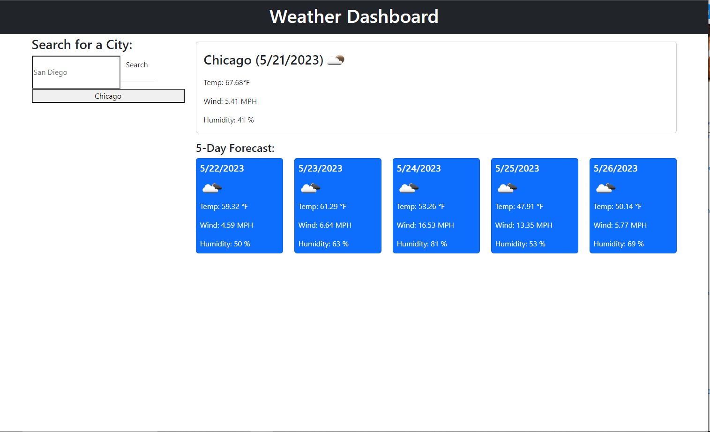

# weather-for-you
A weather dashboard.

## Description

This is a 5-day weather forecast API. Its a dashboard that will run in the browser and feature dynamically updated HTML and CSS. It will display the date, temperature, icons for weather conditions, any wind speed and humidity. You will be able to search any city and it will be displayed in the search history.

## User Story

AS A traveler
I WANT to see the weather outlook for multiple cities
SO THAT I can plan a trip accordingly

## Acceptance Criteria

GIVEN a weather dashboard with form inputs
WHEN I search for a city
THEN I am presented with current and future conditions for that city and that city is added to the search history
WHEN I view current weather conditions for that city
THEN I am presented with the city name, the date, an icon representation of weather conditions, the temperature, the humidity, and the the wind speed
WHEN I view future weather conditions for that city
THEN I am presented with a 5-day forecast that displays the date, an icon representation of weather conditions, the temperature, the wind speed, and the humidity
WHEN I click on a city in the search history
THEN I am again presented with current and future conditions for that city

## Visual

## Links 

[Github Repo](https://github.com/kitkatt17/weather-for-you)

[Deployed Link](https://kitkatt17.github.io/weather-for-you/)